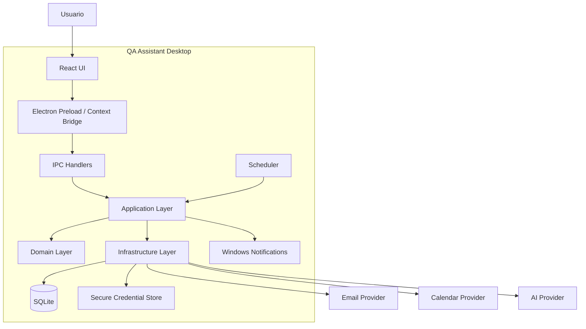
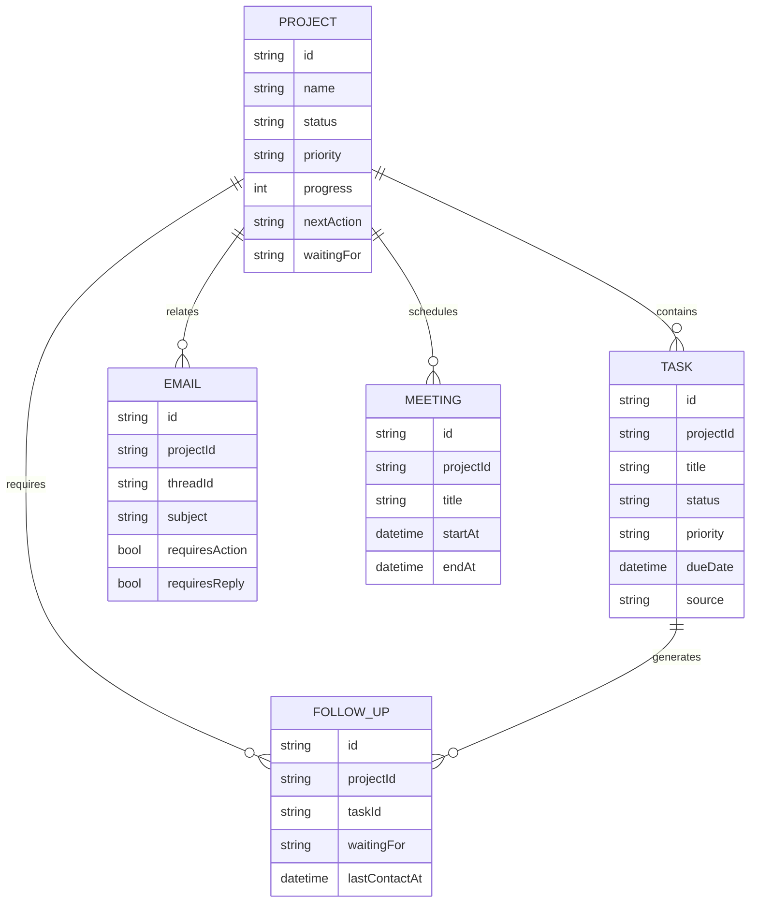
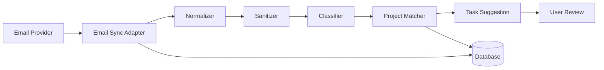
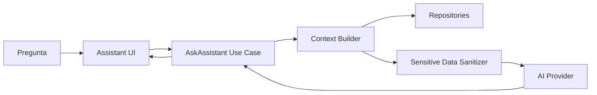
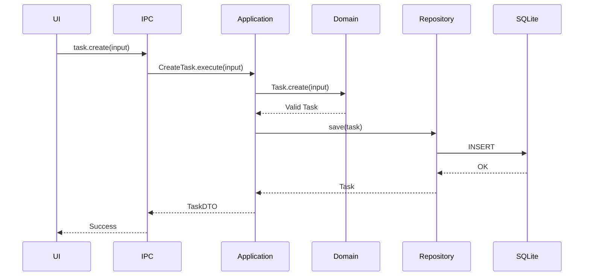
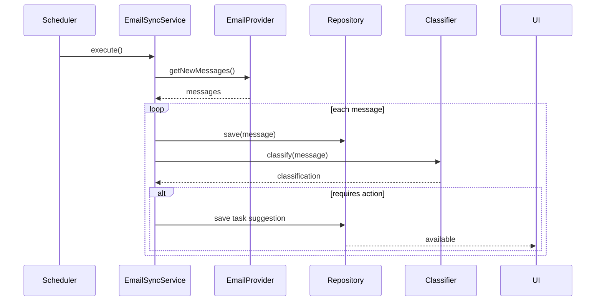

# QA Assistant Desktop — Arquitectura de Software

**Versión:** 0.1  
**Aplicación:** QA Assistant Desktop  
**Plataforma objetivo:** Windows Desktop  
**Stack base:** Electron + React + TypeScript + Node.js + Prisma + SQLite

---

# 1. Objetivo de la arquitectura

La arquitectura debe permitir construir un asistente de escritorio personal para trabajo operativo de QA y Producción, capaz de centralizar:

- Proyectos y requerimientos.
- Tareas y próximas acciones.
- Correos y seguimientos.
- Calendario y reuniones.
- Resúmenes diarios.
- Notificaciones.
- Asistente contextual con IA.
- Futuras capacidades específicas de QA.

La solución debe priorizar:

- Seguridad.
- Mantenibilidad.
- Testabilidad.
- Separación de responsabilidades.
- Funcionamiento local.
- Evolución modular.
- Integraciones desacopladas.
- Historial Git limpio y trazable.

---

# 2. Principios arquitectónicos

1. **Local First**
   - La aplicación debe poder funcionar con sus datos locales aunque no exista conexión temporal a servicios externos.

2. **Clean Architecture**
   - El dominio no debe depender de Electron, React, Prisma, APIs externas ni proveedores de IA.

3. **Separación por capas**
   - Presentation
   - Application
   - Domain
   - Infrastructure

4. **Adapters para integraciones**
   - Correo.
   - Calendario.
   - IA.
   - Notificaciones.
   - Credenciales.

5. **Electron seguro**
   - Renderer aislado.
   - IPC explícito.
   - Sin acceso directo a Node desde React.

6. **Persistencia desacoplada**
   - SQLite mediante repositorios.
   - El dominio no conoce Prisma.

7. **Automatización controlada**
   - La IA sugiere inicialmente.
   - El usuario confirma acciones sensibles.

---

# 3. Vista general



---

# 4. Capas

## 4.1 Presentation Layer

Responsable de la interfaz.

Tecnologías:

- React.
- TypeScript.
- Componentes UI.
- Hooks.
- Stores.
- View Models.

No debe contener reglas de negocio.

### Módulos visuales

- Dashboard.
- Mi Día.
- Proyectos.
- Tareas.
- Correos.
- Calendario.
- Reuniones.
- Seguimientos.
- Reportes.
- Configuración.
- Asistente IA.

### Regla

React nunca debe acceder directamente a:

- Prisma.
- SQLite.
- Filesystem.
- Windows Credential Manager.
- API de correo.
- API de calendario.
- SDK de IA.

---

# 5. Electron Boundary

La comunicación debe ser:

```text
React Renderer
      ↓
Preload
      ↓
contextBridge
      ↓
IPC
      ↓
Application Layer
```

## Configuración requerida

```ts
webPreferences: {
  contextIsolation: true,
  nodeIntegration: false,
  sandbox: true,
  preload: preloadPath
}
```

## Nunca exponer

```ts
window.electron.invoke(channel, payload)
```

de forma genérica.

Preferir APIs específicas:

```ts
window.qa.projects.list()
window.qa.projects.create(data)

window.qa.tasks.listToday()
window.qa.tasks.complete(id)

window.qa.emails.sync()
window.qa.calendar.sync()
```

---

# 6. Application Layer

Contiene los casos de uso.

No debe contener detalles de interfaz.

Ejemplos:

```text
CreateProject
UpdateProject
CloseProject

CreateTask
UpdateTask
CompleteTask
GetTodayTasks

LinkEmailToProject
SuggestTaskFromEmail

DetectFollowUps

GenerateMorningSummary
GenerateEndOfDaySummary

GenerateMeetingBrief
```

Ejemplo conceptual:

```ts
class CreateTask {
  constructor(
    private taskRepository: TaskRepository
  ) {}

  async execute(input: CreateTaskInput) {
    const task = Task.create(input);
    await this.taskRepository.save(task);
    return task;
  }
}
```

---

# 7. Domain Layer

Es el núcleo del sistema.

No conoce:

- Electron.
- React.
- Prisma.
- Microsoft Graph.
- Gmail.
- OpenAI.
- SQLite.
- Windows.

## Entidades

```text
Project
Task
EmailMessage
EmailThread
Meeting
FollowUp
DailySummary
Note
DocumentReference
```

## Value Objects

Recomendados:

```text
ProjectStatus
TaskStatus
Priority
WaitingFor
EmailCategory
TaskSource
DateRange
```

---

# 8. Modelo de dominio

## Project

```text
Project
├── id
├── name
├── code
├── description
├── type
├── status
├── priority
├── progress
├── nextAction
├── waitingFor
├── lastActivityAt
├── createdAt
├── updatedAt
└── closedAt
```

## Task

```text
Task
├── id
├── projectId
├── title
├── description
├── status
├── priority
├── dueDate
├── dueTime
├── source
├── sourceReference
├── waitingFor
├── createdAt
├── updatedAt
└── completedAt
```

## EmailMessage

```text
EmailMessage
├── id
├── providerId
├── threadId
├── subject
├── sender
├── recipients
├── receivedAt
├── bodyPreview
├── summary
├── category
├── requiresAction
├── requiresReply
├── projectId
└── processedAt
```

## Meeting

```text
Meeting
├── id
├── providerId
├── projectId
├── title
├── description
├── startAt
├── endAt
├── organizer
├── meetingUrl
└── summary
```

## FollowUp

```text
FollowUp
├── id
├── projectId
├── taskId
├── emailId
├── waitingFor
├── startedAt
├── lastContactAt
├── nextReminderAt
└── status
```

---

# 9. Infrastructure Layer

Implementa interfaces definidas por las capas superiores.

Ejemplo:

```text
TaskRepository
       ↑
PrismaTaskRepository
```

## Responsabilidades

```text
Database
Email
Calendar
AI
Credential Storage
Notifications
Logging
Scheduler
```

---

# 10. Persistencia

## Tecnología

```text
SQLite
  +
Prisma ORM
```

## Acceso

Solamente desde infraestructura.

```text
Application
      ↓
Repository Interface
      ↓
Prisma Repository
      ↓
SQLite
```

## Nunca

```text
React → Prisma
```

---

# 11. Modelo relacional



---

# 12. Estructura del repositorio

```text
qa-assistant-desktop/
│
├── src/
│   │
│   ├── main/
│   │   ├── main.ts
│   │   ├── preload.ts
│   │   ├── ipc/
│   │   │   ├── projects.ipc.ts
│   │   │   ├── tasks.ipc.ts
│   │   │   ├── emails.ipc.ts
│   │   │   └── calendar.ipc.ts
│   │   ├── scheduler/
│   │   ├── notifications/
│   │   └── security/
│   │
│   ├── renderer/
│   │   ├── app/
│   │   ├── pages/
│   │   │   ├── Dashboard/
│   │   │   ├── MyDay/
│   │   │   ├── Projects/
│   │   │   ├── Tasks/
│   │   │   ├── Emails/
│   │   │   ├── Calendar/
│   │   │   └── Settings/
│   │   ├── components/
│   │   ├── hooks/
│   │   ├── stores/
│   │   └── styles/
│   │
│   ├── domain/
│   │   ├── projects/
│   │   ├── tasks/
│   │   ├── emails/
│   │   ├── meetings/
│   │   ├── followups/
│   │   └── summaries/
│   │
│   ├── application/
│   │   ├── projects/
│   │   ├── tasks/
│   │   ├── emails/
│   │   ├── meetings/
│   │   ├── followups/
│   │   └── assistant/
│   │
│   └── infrastructure/
│       ├── database/
│       │   ├── prisma/
│       │   └── repositories/
│       ├── email/
│       ├── calendar/
│       ├── ai/
│       ├── security/
│       ├── logging/
│       └── notifications/
│
├── prisma/
│   ├── schema.prisma
│   └── migrations/
│
├── tests/
│   ├── unit/
│   ├── integration/
│   └── e2e/
│
├── docs/
│
├── .agent
├── .spec
└── package.json
```

---

# 13. Arquitectura de integración de correo



## Regla inicial

El correo:

```text
no crea tarea automáticamente
```

Genera:

```text
TaskSuggestion
```

El usuario decide:

```text
CREATE
EDIT
IGNORE
```

---

# 14. Arquitectura de calendario

```text
Calendar Provider
       ↓
Calendar Adapter
       ↓
Meeting Synchronizer
       ↓
Meeting Repository
       ↓
Project Matcher
       ↓
Dashboard / Mi Día
```

---

# 15. Arquitectura del asistente IA

La IA no debe consultar directamente los datos.



## Context Builder

Debe construir contexto solo con información relevante.

Ejemplo:

```text
Pregunta:
¿Qué pasó con Cooprogreso?

Context Builder:
- proyecto Cooprogreso
- últimas tareas
- últimos correos
- última reunión
- próxima acción
- seguimiento activo
```

---

# 16. Scheduler

El proceso de Electron Main ejecutará trabajos programados.

```text
Scheduler
│
├── EmailSyncJob
├── CalendarSyncJob
├── FollowUpDetectionJob
├── MorningSummaryJob
├── MeetingBriefJob
└── EndOfDaySummaryJob
```

Ejemplo:

```text
Cada 5 min
Email Sync

Cada 10 min
Calendar Sync

Cada 15 min
Follow-up Check

08:00
Morning Summary

30 min antes
Meeting Brief

17:00
End-of-Day Summary
```

Todos deben:

- evitar ejecución concurrente duplicada;
- manejar errores;
- registrar logs;
- poder configurarse;
- ser idempotentes cuando aplique.

---

# 17. Notificaciones

```text
Application Event
       ↓
Notification Service
       ↓
Windows Notification Adapter
```

Ejemplos:

```text
MeetingStartingSoon

FollowUpRequired

EmailRequiresAction

TaskDueSoon

TaskOverdue
```

---

# 18. Eventos de dominio

Para reducir acoplamiento se recomienda utilizar eventos internos.

Ejemplos:

```text
ProjectCreated
ProjectBlocked
ProjectNextActionChanged

TaskCreated
TaskCompleted
TaskOverdue

EmailReceived
EmailRequiresAction

MeetingStartingSoon

FollowUpRequired
```

---

# 19. Seguridad

## Credenciales

Utilizar:

```text
Windows Credential Manager
```

o un almacén seguro equivalente.

## No almacenar en SQLite

```text
passwords
OAuth refresh tokens
API secrets
PIN
PIN Block
ZPK
ZMK
CVV
PAN completo
```

---

# 20. Sanitización

Pipeline previo a IA:

```text
Raw Content
    ↓
Sensitive Data Detector
    ↓
Sanitizer
    ↓
Safe Context
    ↓
AI Provider
```

Ejemplos:

```text
4232162910066315
→
423216******6315
```

```text
PIN BLOCK
→
[PIN_BLOCK_REDACTED]
```

```text
Bearer eyJ...
→
[TOKEN_REDACTED]
```

---

# 21. Logging

Recomendado:

```text
Structured Logger
```

Campos:

```text
timestamp
level
module
operation
entityId
durationMs
status
errorCode
```

Nunca registrar:

```text
password
token
PAN completo
PIN
PIN Block
ZPK
ZMK
CVV
```

---

# 22. Arquitectura de pruebas

```text
Domain
  ↓
Unit Tests

Application
  ↓
Unit + Integration Tests

Infrastructure
  ↓
Integration Tests

React UI
  ↓
Component Tests

Electron
  ↓
E2E Tests
```

Herramientas:

```text
Vitest
React Testing Library
Playwright
```

---

# 23. Pipeline de calidad local

Antes de commit:

```text
npm run lint
        ↓
npm run typecheck
        ↓
npm run test
        ↓
npm run test:integration
        ↓
npm run test:e2e
        ↓
npm run build
        ↓
git diff
        ↓
commit
```

---

# 24. Estrategia Git

Cada funcionalidad debe dividirse en commits lógicos.

Ejemplo:

```text
feat(domain): add project entity and status rules

feat(database): add project persistence

feat(projects): add create project use case

feat(ipc): expose project commands

feat(ui): add project creation screen

test(projects): cover project creation workflow
```

No mezclar cambios no relacionados.

---

# 25. Flujo de creación de una tarea



---

# 26. Flujo de sincronización de correo



---

# 27. Módulos del producto

```text
Core
├── Projects
├── Tasks
├── My Day
└── Dashboard

Productivity
├── Email
├── Calendar
├── Meetings
└── Follow-ups

Automation
├── Scheduler
├── Notifications
├── Daily Summary
└── Meeting Brief

AI
├── Classifier
├── Summarizer
├── Action Extractor
└── Assistant

Future QA
├── Certifications
├── Test Cases
├── Defects
├── Evidence
├── Logs
├── ISO8583
└── Reports
```

---

# 28. Orden recomendado de implementación

## Fase 1

```text
Electron shell
React shell
SQLite
Prisma
Project
Task
Dashboard
Mi Día
```

## Fase 2

```text
Next Action
Waiting For
Follow-ups
Notifications
System Tray
```

## Fase 3

```text
Email Provider
Synchronization
Thread grouping
Classification
Task suggestions
```

## Fase 4

```text
Calendar
Meetings
Meeting Brief
Daily Summary
```

## Fase 5

```text
Context Builder
AI Assistant
```

## Fase 6

```text
QA technical modules
```

---

# 29. Decisiones arquitectónicas iniciales

## ADR-001
**Electron + React + TypeScript**

Motivo:
- Aplicación Windows moderna.
- Ecosistema amplio.
- Posibilidad de UI rica.
- Integración con servicios de escritorio.

## ADR-002
**SQLite para persistencia local**

Motivo:
- No requiere servidor.
- Adecuado para un usuario.
- Portable.
- Fácil respaldo.

## ADR-003
**Prisma como ORM**

Motivo:
- Tipado.
- Migraciones.
- Productividad.
- Buena integración con TypeScript.

## ADR-004
**Clean Architecture**

Motivo:
- Evitar dependencia fuerte con Electron.
- Facilitar pruebas.
- Permitir cambiar proveedores externos.

## ADR-005
**IA detrás de Adapter**

Motivo:
- Poder cambiar proveedor.
- Permitir mocks.
- Mantener el dominio independiente.

---

# 30. Estado objetivo

La arquitectura final debe permitir que:

```text
Correos
Calendario
Tareas manuales
Proyectos
Documentos
        ↓
Normalización
        ↓
Application Layer
        ↓
Domain
        ↓
Persistencia
        ↓
Context Builder
        ↓
Dashboard / Asistente
```

sin que ninguna integración externa controle el núcleo del producto.

---

# 31. Regla principal

La aplicación debe seguir siendo funcional incluso si:

```text
Email Provider falla
Calendar Provider falla
AI Provider falla
```

Las funcionalidades locales:

```text
Projects
Tasks
My Day
Dashboard
Notes
Follow-ups
```

deben continuar operativas.

Esta separación constituye el criterio arquitectónico principal del proyecto.
